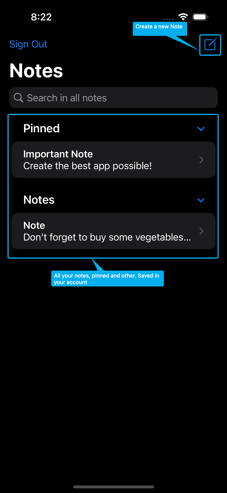
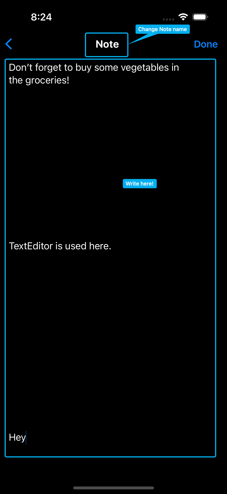

# Notes SwiftUI

## Description 

A simple notes app. Login and Reg is done with Firebase Auth. All notes are saved in Firebase Firestore. Note writing is done with TextEditor.\
This project needs a lot of refactoring...

## Screenshots

    

    

    

## P. S.

This app was made, because my girlfriend's notes were deleted from iCloud with no reason, but then we figured out why they were deleted and I didn't continue to develop this notes app.
